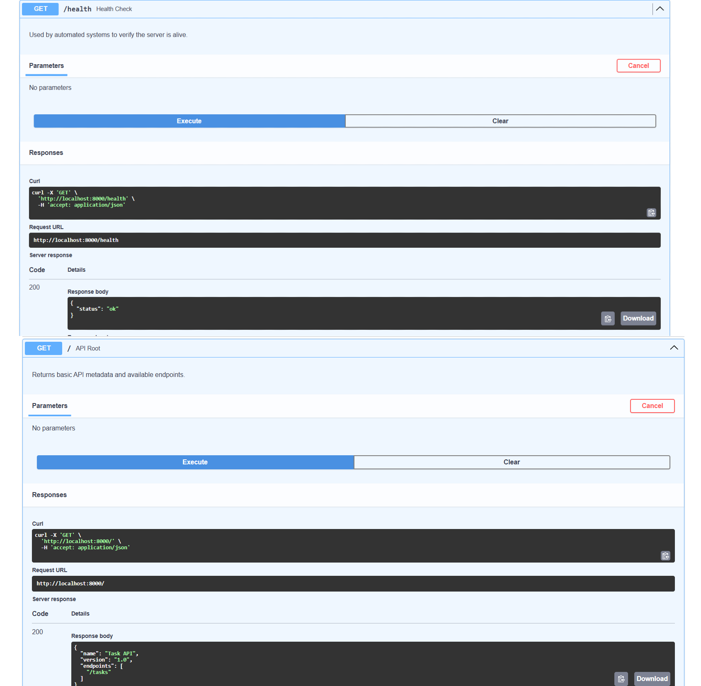
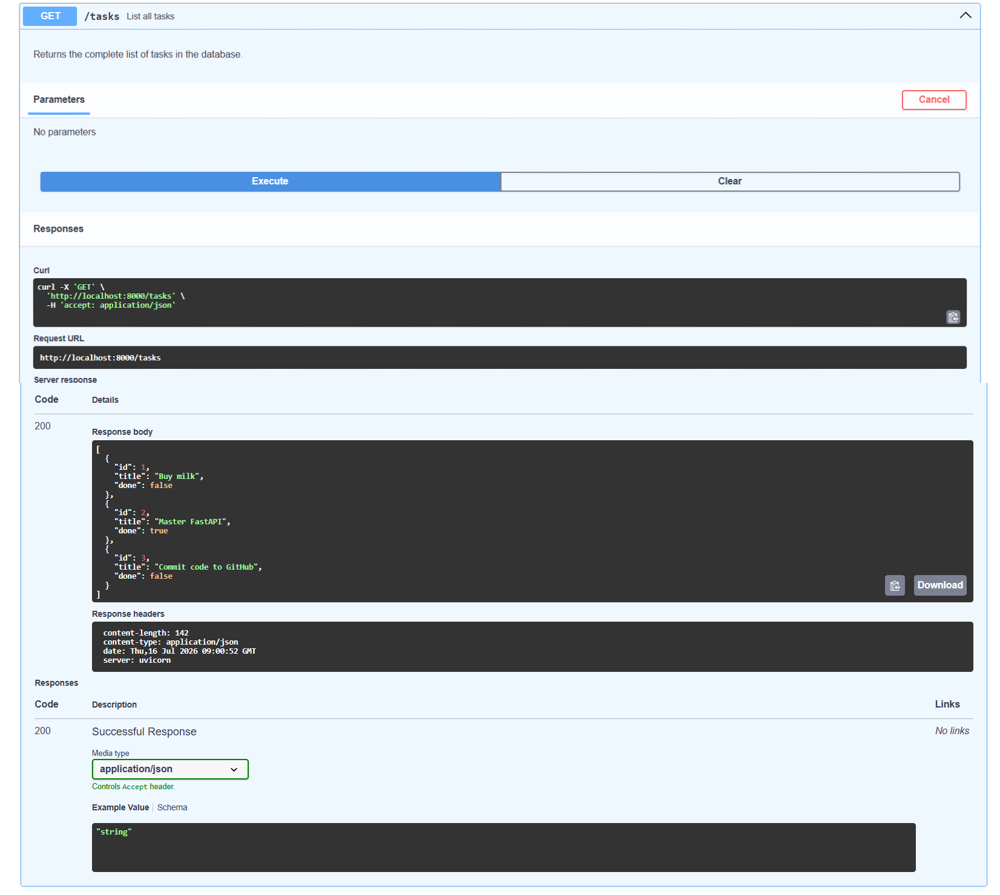
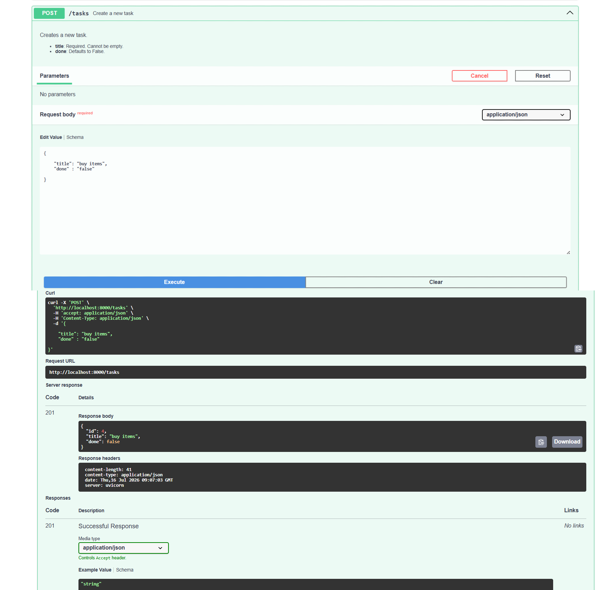
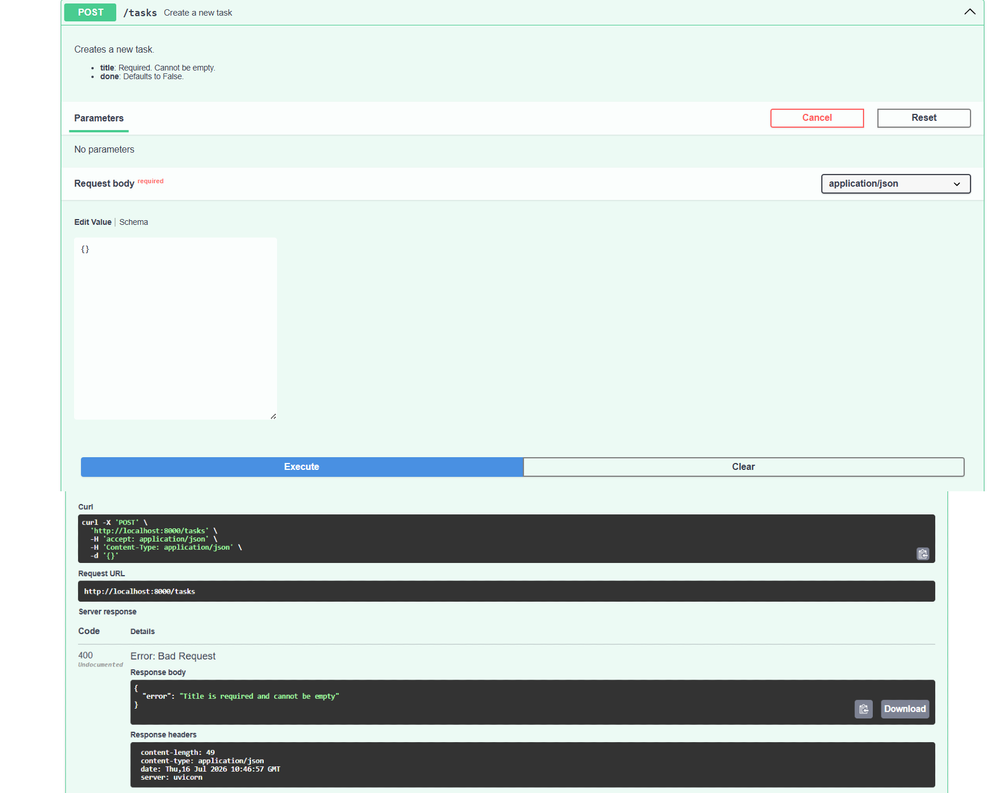
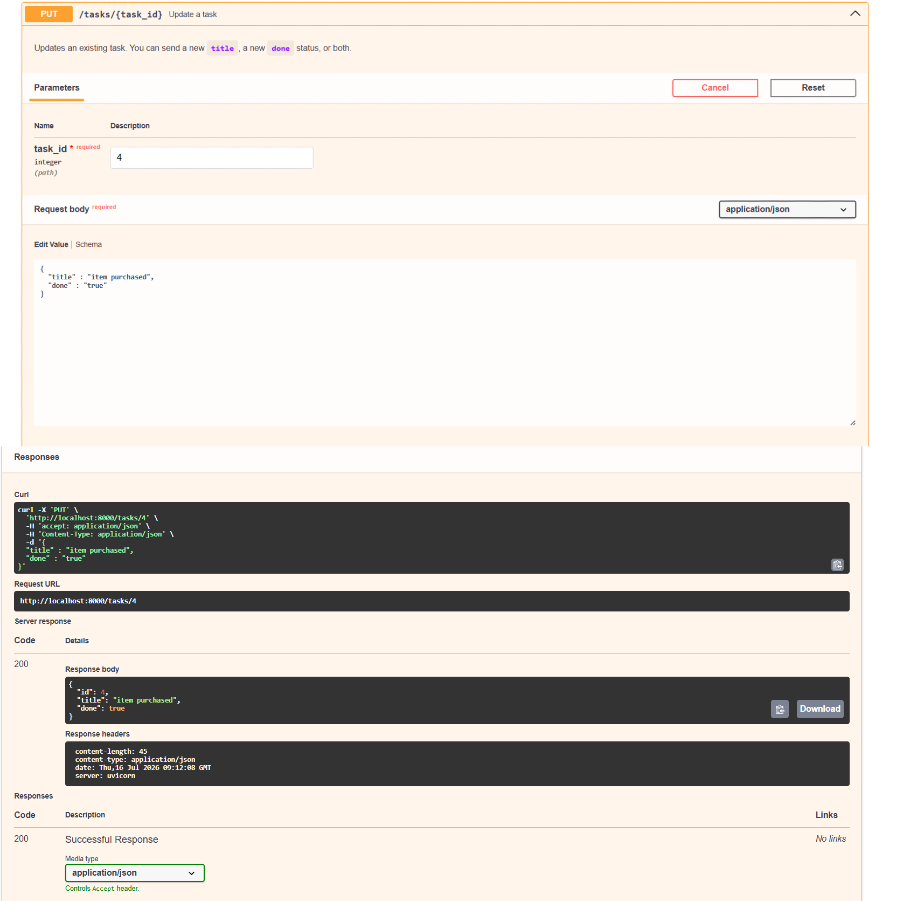
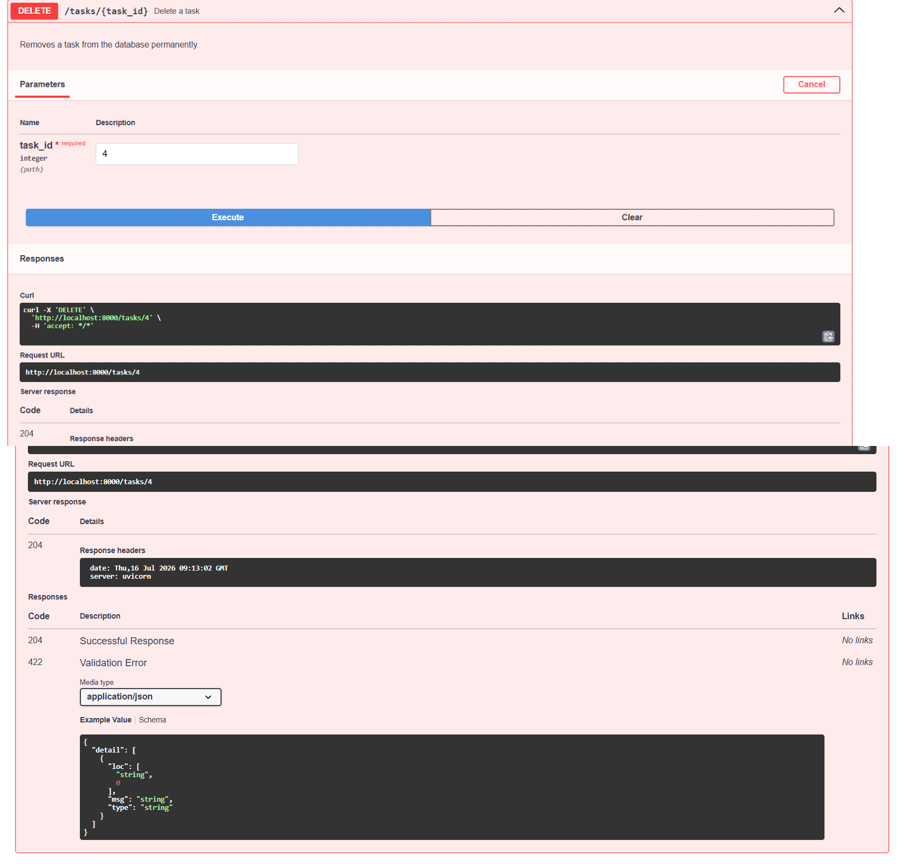
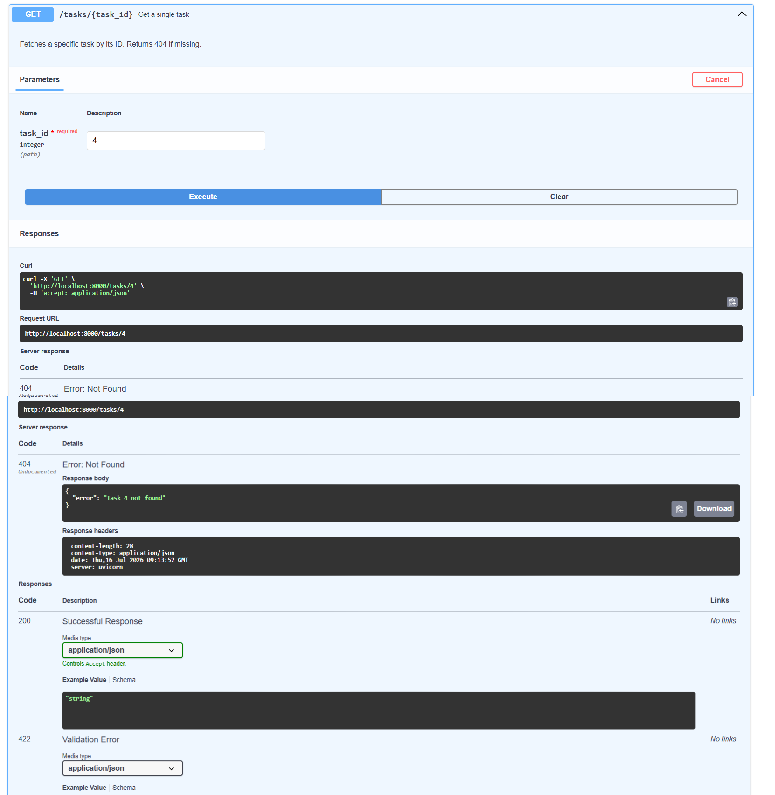

# 📝 FastAPI To-Do List API


This is a lightweight, fully functional REST API that manages a to-do list. Built using **Python** and **FastAPI**, it supports the full CRUD (Create, Read, Update, Delete) cycle and validates client input with automatic error handling.

> **💡 Note:** Currently, the data lives in an in-memory Python list, meaning data resets when the server restarts. This makes it a perfect sandbox for learning and experimenting with the HTTP Request/Response loop!

---

## 🚀 How to Install & Run

### 1. Prerequisites
Ensure you have Python installed on your local machine.

### 2. Install Dependencies
Install FastAPI and the Uvicorn ASGI server using `pip`:

```bash
pip install fastapi uvicorn
```

### 3. Start the Server
Run the application with auto-reload enabled for development:

```bash
uvicorn main:app --reload --port 8000
```

### 4. Explore Interactive Docs
Open your browser and go to **[http://localhost:8000/docs](http://localhost:8000/docs)** to see the interactive **Swagger UI**! You can also check out the alternative ReDoc interface at `http://localhost:8000/redoc`.

---

## 🛣️ API Endpoints

| HTTP Method | Endpoint | Description | Status Codes |
| :--- | :--- | :--- | :--- |
| `GET` | `/` | API Root / Metadata | `200 OK` |
| `GET` | `/health` | Server health check | `200 OK` |
| `GET` | `/tasks` | List all tasks | `200 OK` |
| `GET` | `/tasks/{id}` | Get a single task by ID | `200 OK`, `404 Not Found` |
| `POST` | `/tasks` | Create a new task | `201 Created`, `400 Bad Request` |
| `PUT` | `/tasks/{id}` | Update an existing task | `200 OK`, `400 Bad Request`, `404 Not Found` |
| `DELETE` | `/tasks/{id}` | Remove a task | `204 No Content`, `404 Not Found` |

---

## 💻 Sample `curl` Output

Here is what it looks like to fetch a specific task from the terminal:

```bash
$ curl -i http://localhost:8000/tasks/1
```

```http
HTTP/1.1 200 OK
date: Thu, 16 Jul 2026 09:30:00 GMT
server: uvicorn
content-length: 46
content-type: application/json

{"id":1,"title":"Buy milk","done":false}
```

---

## 📸 Interactive Documentation & Gallery

FastAPI automatically generates a Swagger UI page based on the OpenAPI specification of your code. Below is the main interactive documentation structure, followed by a comprehensive gallery of the API's functionality across all CRUD stages.

### Main Swagger UI Dashboard
<!-- Replace the path below with your actual screenshot path -->


### 📂 Full API Functionality Gallery

*Note to viewer: The following screenshots demonstrate the server successfully handling various HTTP methods, status codes, and input validation.*

| Stage / Feature | Screenshot |
| :--- | :--- |
| **Stage 1: Root & Health Check** (`GET`) |  |
| **Stage 2: Read All Tasks** (`GET`) |  |
| **Stage 3: Create Task** (`POST 201`) |  |
| **Stage 3: Validation Error** (`POST 400`) |  |
| **Stage 4: Update Task** (`PUT 200`) |  |
| **Stage 4: Delete Task** (`DELETE 204`) |  |
| **Error Handling: Unknown ID** (`404 Not Found`) |  |
<!-- | **Terminal / Curl Logs** |  |
| **Additional View 1** |  |
| **Additional View 2** |  | -->